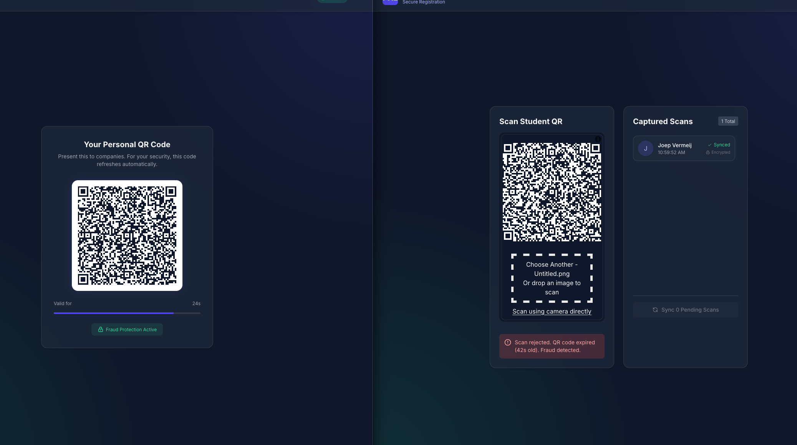
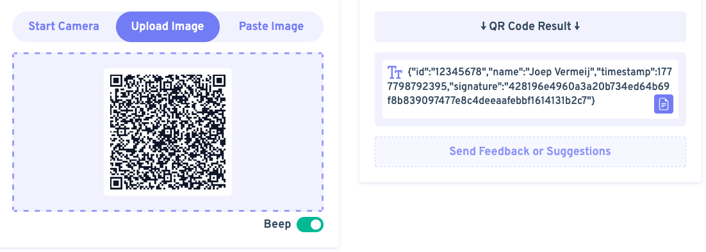
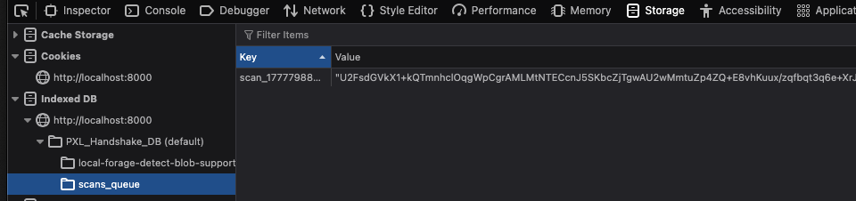

# Verantwoording POC Implementatie

Dit document beschrijft beknopt hoe de theoretische concepten uit het onderzoek effectief in de Proof of Concept (POC) zijn gebouwd.

## 1. QR-code Beveiliging (Fraudebestendigheid)
* **Dynamische QR-codes**: De POC genereert elke 30 seconden een nieuwe QR-code met een live timestamp. De scanner weigert codes ouder dan 35 seconden, waardoor het maken en gebruiken van screenshots (proxy-attendance) onmogelijk is.

* **Cryptografische Handtekening (Tamper-proofing)**: Als praktisch alternatief voor zware "digital watermarks", gebruikt de POC een SHA-256 hash. Elke QR-code bevat een handtekening gebaseerd op het student-ID, de timestamp en een geheime sleutel. Aanpassingen aan de code maken de handtekening direct ongeldig.

* **Hardware restricties (IMEI)**: De in de literatuur voorgestelde IMEI-check is **niet** geïmplementeerd. Webbrowsers blokkeren toegang tot hardware-identifiers (IMEI) uit privacy-overwegingen. Hiervoor is een native mobiele app vereist.

## 2. GDPR-Compliance & Veiligheid
* **Expliciete Toestemming (Consent)**: Voordat een QR-code gegenereerd wordt, is de student verplicht via de interface expliciet akkoord te gaan met het delen van zijn/haar PII en CV. Hiermee wordt voldaan aan de AVG/GDPR vereisten voor data-uitwisseling.

* **Lokale Data Encryptie (OWASP richtlijnen)**: Om datalekken bij offline opslag te voorkomen, wordt opgeslagen data nooit als platte tekst bewaard. De `CryptoJS` library versleutelt (via Advanced Encryption Standard / AES) elke scan vóórdat deze lokaal weggeschreven wordt.

## 3. Offline-First Architectuur (Robuustheid)
* **Lokale Browser Opslag**: In plaats van mobiele databases zoals SQLite, gebruikt deze Vue.js applicatie de browser-native IndexedDB (via de `localForage` library). Scans worden direct lokaal geregistreerd, waardoor de scanner naadloos werkt bij netwerkuitval.
* **Synchronisatie**: De POC monitort de verbinding (`navigator.onLine`). Bij herstel van de verbinding kan de lokaal gecachete (en versleutelde) wachtrij eenvoudig en in batch naar de backend gesynchroniseerd worden, zonder dat er verlies van data optreedt. Complex versiebeheer voor conflict detectie was hier niet nodig, gezien het dataverkeer slechts in één richting loopt (van scanner naar server).
